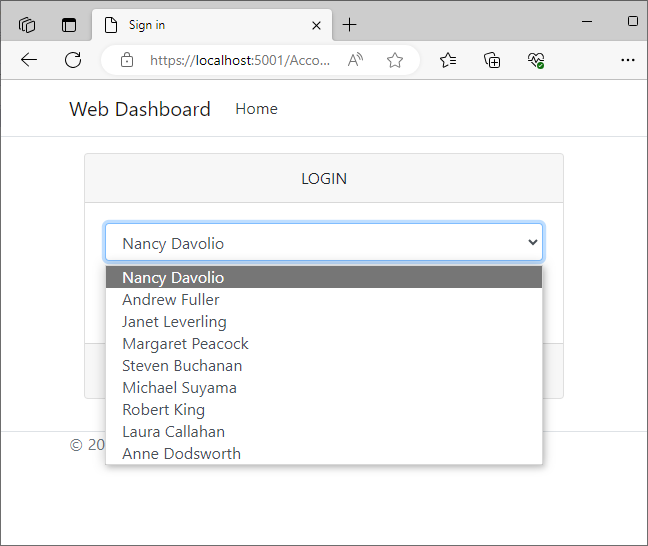
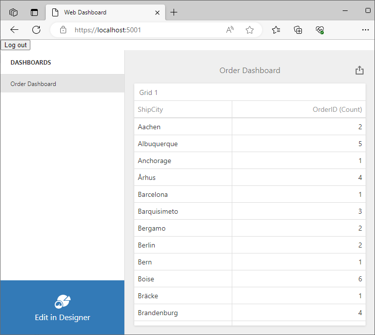

<!-- default badges list -->

[](https://supportcenter.devexpress.com/ticket/details/T1172361)
[](https://docs.devexpress.com/GeneralInformation/403183)
<!-- default badges end -->
# BI Dashboard for ASP.NET Core - Implement Row-Level Security 

This example assumes that multiple users share the same database. The application sets the current user ID in [SESSION_CONTEXT](https://learn.microsoft.com/en-us/sql/t-sql/functions/session-context-transact-sql?view=sql-server-ver16&viewFallbackFrom=sql-server-ver16). When the database connection opens, security policies filter rows that shouldn't be visible to the current user.

## Files to Review

- [RLSConnectionInterceptor.cs](./WebDashboardInterceptors/RLSConnectionInterceptor.cs)
- [Program.cs](./WebDashboardInterceptors/Program.cs)
- [AccountController.cs](./WebDashboardInterceptors/Controllers/AccountController.cs)
- [Login.cshtml](./WebDashboardInterceptors/Views/Account/Login.cshtml)

## Example Overview

### Configure a Database

1. This example uses an SQL file ([instnwnd.sql](https://github.com/microsoft/sql-server-samples/blob/master/samples/databases/northwind-pubs/instnwnd.sql)). Execute it to recreate the database on your side. Do not forget to update [appsettings.json](./WebDashboardInterceptors/appsettings.json) and [Program.cs](./WebDashboardInterceptors/Program.cs): make the connection string valid in your environment.

2. Execute the script below. The script extends the database as follows:

    - Creates a new schema and predicate function, which uses the user ID stored in SESSION_CONTEXT to filter rows. 
    - Creates a security policy that adds this function as a filter predicate and a block predicate on _Orders_.  

```sql
CREATE SCHEMA Security;
GO

CREATE FUNCTION Security.fn_securitypredicate(@EmployeeId int)
    RETURNS TABLE
    WITH SCHEMABINDING
AS
    RETURN SELECT 1 AS fn_securitypredicate_result
    WHERE CAST(SESSION_CONTEXT(N'EmployeeId') AS int) = @EmployeeId;
GO

CREATE SECURITY POLICY Security.OrdersFilter
    ADD FILTER PREDICATE Security.fn_securitypredicate(EmployeeId)
        ON dbo.Orders,
    ADD BLOCK PREDICATE Security.fn_securitypredicate(EmployeeId)
        ON dbo.Orders AFTER INSERT
    WITH (STATE = ON);
GO
```
### Configure an `IDBConnectionInterceptor` Object 

Create an `IDBConnectionInterceptor` object ([RLSConnectionInterceptor.cs](./WebDashboardInterceptors/RLSConnectionInterceptor.cs) in this example). When the database connection opens, store the current user ID in SESSION_CONTEXT. Modify queries to the _Order_ table - filter data by user ID. This way you implement database behavior equivalent to connection filtering.

Register `RLSConnectionInterceptor` in `DashboardConfigurator`.

### Run the Application

When you run the application, the registration form ([Login.cshtml](./WebDashboardInterceptors/Views/Account/Login.cshtml)) appears. 



Select a user to see the dashboard with filtered data.


